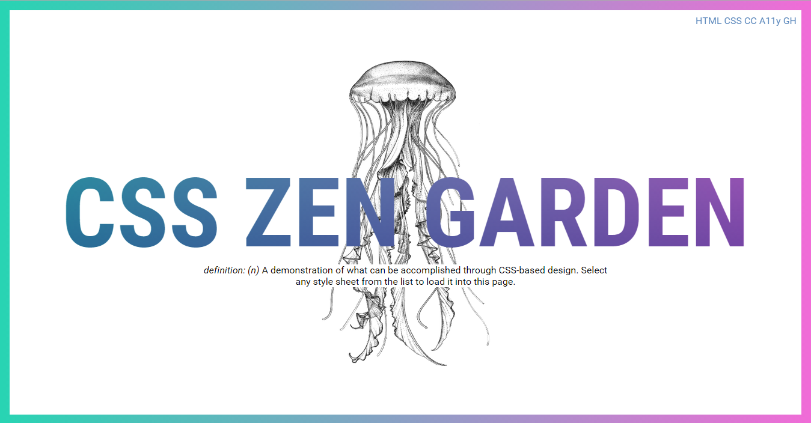

# A Prototype for a CSS Zen Garden Submission

I am not even sure if they still accepts submissions, but this is a WIP for a submission anyhow. I've yet to really decide on a solid theme. Maybe jellyfish, maybe gradients, maybe squares. The world is vast. Endless. Lots of different gradients and squares to choose from, maybe not as many jellyfish. WIP screenshot here:

